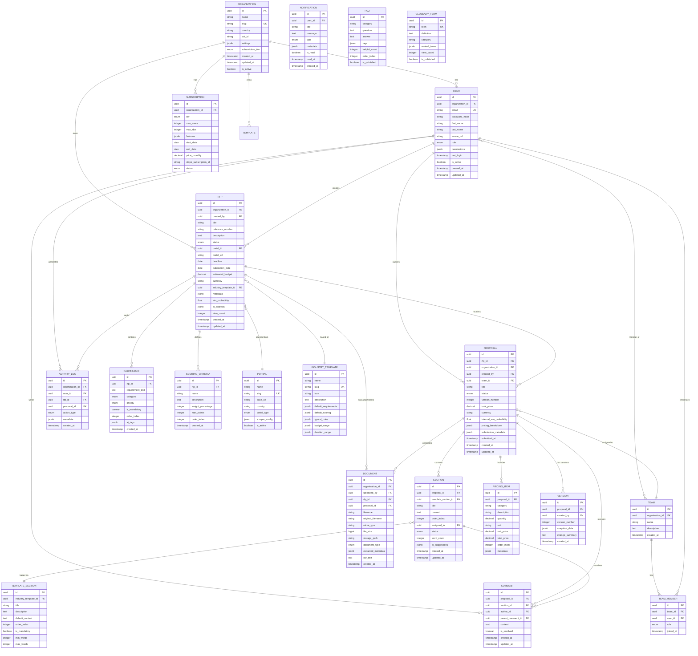

# Backend Architecture Design
## RFP Winning Assistant - Enterprise-Grade Backend

**Version:** 1.0
**Datum:** 2025-11-03
**Autor:** Senior Backend Architecture Team
**Status:** Design Specification

---

## Executive Summary

Dieses Dokument definiert die vollständige Backend-Architektur für den **RFP Winning Assistant** - eine Enterprise-Level Plattform für das Management öffentlicher Ausschreibungen mit KI-gestützter Analyse, Kollaboration und DSGVO-konformer Datenhaltung.

### Kernziele

1. **Skalierbare Multi-Tenant Architektur** für B2B SaaS
2. **DSGVO-konforme Datenhaltung** mit EU-Hosting
3. **RESTful API** mit JWT-basierter Authentifizierung
4. **AI/ML Integration** für Win Probability & Requirements Analysis
5. **Real-time Collaboration** via WebSockets
6. **Dokumenten-Management** mit PDF/DOCX Processing
7. **Security First** - ISO 27001 & BSI IT-Grundschutz konform

### Technology Stack Empfehlung

| Layer | Technology | Begründung |
|-------|-----------|------------|
| **Runtime** | Node.js 20 LTS | Performance, TypeScript Support, große Community |
| **Framework** | NestJS | Enterprise-ready, TypeScript-native, modulare Architektur |
| **Database** | PostgreSQL 16 | ACID, Compliance, JSON Support, Replication |
| **Cache** | Redis 7 | Session Store, Rate Limiting, Real-time Features |
| **Search** | Elasticsearch 8 | Full-text Search für RFPs, Requirements, Documents |
| **Object Storage** | MinIO / S3 | Dokumente, Uploads, Exports (DSGVO-konform) |
| **Message Queue** | RabbitMQ | Async Processing, Email, PDF Generation |
| **Auth** | Passport.js + JWT | Industry Standard, Multi-Strategy Support |
| **ORM** | TypeORM | TypeScript-native, Migration Support, Active Record |
| **API Docs** | Swagger/OpenAPI | Auto-generated, Interactive Documentation |
| **Monitoring** | Prometheus + Grafana | Metrics, Alerting, Performance Monitoring |
| **Logging** | Winston + ELK Stack | Structured Logging, Audit Trail |

---

## 1. System Architecture

### 1.1 High-Level Architecture

```
┌─────────────────────────────────────────────────────────────────┐
│                        Client Layer                              │
│  React SPA │ Mobile App │ CLI Tools │ Third-Party Integrations   │
└────────────────────────┬────────────────────────────────────────┘
                         │ HTTPS/WSS
                         ▼
┌─────────────────────────────────────────────────────────────────┐
│                     API Gateway / Load Balancer                  │
│  NGINX │ Rate Limiting │ SSL Termination │ DDoS Protection      │
└────────────────────────┬────────────────────────────────────────┘
                         │
                         ▼
┌─────────────────────────────────────────────────────────────────┐
│                    Application Layer (NestJS)                    │
├─────────────────────────────────────────────────────────────────┤
│  API Gateway Module          │  WebSocket Gateway               │
│  - REST Controllers          │  - Real-time Collaboration       │
│  - GraphQL Resolvers (opt.)  │  - Notifications                 │
│  - Rate Limiting             │  - Live Updates                  │
├──────────────────────────────┴──────────────────────────────────┤
│                      Business Logic Layer                        │
│  ┌──────────────┐ ┌──────────────┐ ┌────────────────────────┐  │
│  │ Auth Service │ │ RFP Service  │ │ Proposal Service       │  │
│  │ - JWT        │ │ - CRUD       │ │ - Templates            │  │
│  │ - Roles      │ │ - Scoring    │ │ - Sections             │  │
│  │ - Perms      │ │ - Deadlines  │ │ - Collaboration        │  │
│  └──────────────┘ └──────────────┘ └────────────────────────┘  │
│  ┌──────────────┐ ┌──────────────┐ ┌────────────────────────┐  │
│  │ AI Service   │ │ Doc Service  │ │ Notification Service   │  │
│  │ - Win Prob   │ │ - PDF Gen    │ │ - Email                │  │
│  │ - Analysis   │ │ - DOCX Parse │ │ - In-App               │  │
│  │ - Scoring    │ │ - Templates  │ │ - Webhooks             │  │
│  └──────────────┘ └──────────────┘ └────────────────────────┘  │
│  ┌──────────────┐ ┌──────────────┐ ┌────────────────────────┐  │
│  │ Team Service │ │ Portal Sync  │ │ Analytics Service      │  │
│  │ - Members    │ │ - DTVP       │ │ - Dashboards           │  │
│  │ - Assign     │ │ - TED        │ │ - Reports              │  │
│  │ - Activity   │ │ - Bund.de    │ │ - Exports              │  │
│  └──────────────┘ └──────────────┘ └────────────────────────┘  │
└────────────────────────┬────────────────────────────────────────┘
                         │
         ┌───────────────┼───────────────┬───────────────┐
         ▼               ▼               ▼               ▼
┌──────────────┐ ┌─────────────┐ ┌─────────────┐ ┌─────────────┐
│ PostgreSQL   │ │   Redis     │ │Elasticsearch│ │   MinIO     │
│ (Primary DB) │ │ (Cache/     │ │ (Search)    │ │ (Storage)   │
│              │ │  Session)   │ │             │ │             │
└──────────────┘ └─────────────┘ └─────────────┘ └─────────────┘
         │
         ▼
┌──────────────┐
│ PostgreSQL   │
│ (Replica)    │
│ Read-Only    │
└──────────────┘
```

### 1.2 Microservices vs. Monolith

**Phase 1 (MVP):** Modularer Monolith
- Schnellere Entwicklung
- Einfacheres Deployment
- Geringere Infrastruktur-Kosten
- NestJS Module als "Service Boundaries"

**Phase 2 (Scale):** Microservices Migration
- RFP Service → Eigener Service
- AI Service → Eigener Service (GPU Support)
- Document Service → Eigener Service
- Portal Sync → Eigener Service

---

## 2. Database Schema (ERD)

### 2.1 Entity Relationship Diagram



### 2.2 Database Indexing Strategy

```sql
-- High-Performance Indexes für häufige Queries

-- RFP Searches
CREATE INDEX idx_rfp_deadline ON rfp(deadline) WHERE deadline >= CURRENT_DATE;
CREATE INDEX idx_rfp_status ON rfp(status) WHERE status != 'archived';
CREATE INDEX idx_rfp_organization ON rfp(organization_id, created_at DESC);
CREATE INDEX idx_rfp_win_probability ON rfp(win_probability DESC) WHERE status = 'active';
CREATE INDEX idx_rfp_fulltext ON rfp USING gin(to_tsvector('german', title || ' ' || description));

-- Proposal Queries
CREATE INDEX idx_proposal_rfp ON proposal(rfp_id, status);
CREATE INDEX idx_proposal_team ON proposal(team_id, status);
CREATE INDEX idx_proposal_status ON proposal(status, updated_at DESC);

-- User & Auth
CREATE UNIQUE INDEX idx_user_email ON "user"(email) WHERE is_active = true;
CREATE INDEX idx_user_organization ON "user"(organization_id, role);

-- Activity & Audit
CREATE INDEX idx_activity_org_date ON activity_log(organization_id, created_at DESC);
CREATE INDEX idx_activity_user ON activity_log(user_id, created_at DESC);

-- Documents
CREATE INDEX idx_document_rfp ON document(rfp_id, document_type);
CREATE INDEX idx_document_proposal ON document(proposal_id, created_at DESC);

-- Multi-Tenancy Performance
CREATE INDEX idx_rfp_org_composite ON rfp(organization_id, status, deadline);
CREATE INDEX idx_proposal_org_composite ON proposal(organization_id, status, updated_at);
```

---

## 3. RESTful API Design

### 3.1 API Versioning & Base URL

```
Base URL: https://api.rfp-winning.com/v1
Authentication: Bearer JWT Token in Authorization Header
Content-Type: application/json
```

### 3.2 Authentication & Authorization

#### POST /auth/register
Neues Unternehmen registrieren (Self-Service Signup)

**Request:**
```json
{
  "organization": {
    "name": "Acme Consulting GmbH",
    "country": "DE",
    "vat_id": "DE123456789"
  },
  "user": {
    "email": "admin@acme.com",
    "password": "SecureP@ssw0rd!",
    "first_name": "Max",
    "last_name": "Mustermann"
  },
  "subscription_tier": "professional"
}
```

**Response 201:**
```json
{
  "success": true,
  "data": {
    "organization": {
      "id": "org_8x7f9a2b",
      "name": "Acme Consulting GmbH",
      "slug": "acme-consulting-gmbh"
    },
    "user": {
      "id": "usr_9k3l2m4n",
      "email": "admin@acme.com",
      "role": "admin"
    },
    "access_token": "eyJhbGciOiJIUzI1NiIsInR5cCI6IkpXVCJ9...",
    "refresh_token": "eyJhbGciOiJIUzI1NiIsInR5cCI6IkpXVCJ9...",
    "expires_in": 3600
  }
}
```

#### POST /auth/login
Login mit Email & Passwort

**Request:**
```json
{
  "email": "admin@acme.com",
  "password": "SecureP@ssw0rd!"
}
```

**Response 200:**
```json
{
  "success": true,
  "data": {
    "user": {
      "id": "usr_9k3l2m4n",
      "email": "admin@acme.com",
      "first_name": "Max",
      "last_name": "Mustermann",
      "role": "admin",
      "organization": {
        "id": "org_8x7f9a2b",
        "name": "Acme Consulting GmbH"
      }
    },
    "access_token": "eyJhbGciOiJIUzI1NiIsInR5cCI6IkpXVCJ9...",
    "refresh_token": "eyJhbGciOiJIUzI1NiIsInR5cCI6IkpXVCJ9...",
    "expires_in": 3600
  }
}
```

#### POST /auth/refresh
Token erneuern

**Request:**
```json
{
  "refresh_token": "eyJhbGciOiJIUzI1NiIsInR5cCI6IkpXVCJ9..."
}
```

#### POST /auth/logout
Logout (Token invalidieren)

#### POST /auth/forgot-password
Passwort-Reset anfordern

#### POST /auth/reset-password
Passwort zurücksetzen

---

### 3.3 RFP Management

#### GET /rfps
Liste aller RFPs (mit Pagination, Filter, Sort)

**Query Parameters:**
- `page` (default: 1)
- `limit` (default: 20, max: 100)
- `status` (active, bid_decision, proposal_writing, submitted, won, lost, archived)
- `portal` (portal slug)
- `min_budget`, `max_budget`
- `deadline_from`, `deadline_to`
- `search` (full-text search in title/description)
- `sort` (deadline, win_probability, budget, created_at)
- `order` (asc, desc)

**Response 200:**
```json
{
  "success": true,
  "data": {
    "rfps": [
      {
        "id": "rfp_7h4j9k2l",
        "title": "Entwicklung einer Web-Plattform für Bürgerbeteiligung",
        "reference_number": "2024-IT-12345",
        "status": "active",
        "deadline": "2025-12-15T23:59:59Z",
        "estimated_budget": 250000,
        "currency": "EUR",
        "portal": {
          "id": "portal_dtvp",
          "name": "DTVP",
          "url": "https://www.dtvp.de/..."
        },
        "win_probability": 68,
        "industry": "it-web",
        "created_at": "2025-11-01T10:30:00Z",
        "updated_at": "2025-11-02T14:20:00Z"
      }
    ],
    "pagination": {
      "page": 1,
      "limit": 20,
      "total": 156,
      "total_pages": 8
    }
  }
}
```

#### POST /rfps
Neue RFP anlegen (manuell oder Import)

**Request:**
```json
{
  "title": "Entwicklung einer Web-Plattform für Bürgerbeteiligung",
  "reference_number": "2024-IT-12345",
  "description": "Die Stadt XY sucht einen Dienstleister für...",
  "portal_id": "portal_dtvp",
  "portal_url": "https://www.dtvp.de/...",
  "deadline": "2025-12-15T23:59:59Z",
  "publication_date": "2025-11-01",
  "estimated_budget": 250000,
  "currency": "EUR",
  "industry_template_id": "it-web",
  "status": "active"
}
```

**Response 201:**
```json
{
  "success": true,
  "data": {
    "id": "rfp_7h4j9k2l",
    "title": "Entwicklung einer Web-Plattform für Bürgerbeteiligung",
    "win_probability": null,
    "ai_analysis": {
      "status": "pending",
      "message": "AI-Analyse wird im Hintergrund durchgeführt"
    },
    "created_at": "2025-11-03T09:15:00Z"
  }
}
```

#### GET /rfps/:id
Einzelne RFP Details

**Response 200:**
```json
{
  "success": true,
  "data": {
    "id": "rfp_7h4j9k2l",
    "title": "Entwicklung einer Web-Plattform für Bürgerbeteiligung",
    "reference_number": "2024-IT-12345",
    "description": "Die Stadt XY sucht...",
    "status": "active",
    "portal": {
      "id": "portal_dtvp",
      "name": "DTVP",
      "url": "https://www.dtvp.de/..."
    },
    "deadline": "2025-12-15T23:59:59Z",
    "days_until_deadline": 42,
    "estimated_budget": 250000,
    "currency": "EUR",
    "industry_template": {
      "id": "it-web",
      "name": "IT - Web Development"
    },
    "requirements": [
      {
        "id": "req_1a2b3c",
        "text": "Responsive Design für alle Endgeräte",
        "category": "functional",
        "priority": "must-have",
        "is_mandatory": true
      }
    ],
    "scoring_criteria": [
      {
        "id": "score_x9y8z7",
        "name": "Technisches Konzept",
        "description": "Qualität und Innovation der technischen Lösung",
        "weight_percentage": 35,
        "max_points": 100
      }
    ],
    "win_probability": 68,
    "ai_analysis": {
      "requirements_fit": 85,
      "team_strength": 72,
      "price_competitiveness": 60,
      "recommendations": [
        "Betonen Sie Ihre WCAG 2.1 AA Expertise",
        "3 vergleichbare Referenzen im öffentlichen Sektor empfohlen"
      ],
      "risk_factors": [
        "Kurze Deadline (42 Tage)",
        "Budget könnte knapp sein für Scope"
      ]
    },
    "documents": [
      {
        "id": "doc_4k5l6m",
        "filename": "Leistungsbeschreibung.pdf",
        "file_size": 2458624,
        "uploaded_at": "2025-11-01T10:30:00Z"
      }
    ],
    "proposal": {
      "id": "prop_8n9o0p",
      "status": "draft",
      "version": 3,
      "last_updated": "2025-11-02T16:45:00Z"
    },
    "created_by": {
      "id": "usr_9k3l2m4n",
      "name": "Max Mustermann"
    },
    "created_at": "2025-11-01T10:30:00Z",
    "updated_at": "2025-11-02T14:20:00Z"
  }
}
```

#### PATCH /rfps/:id
RFP aktualisieren

**Request:**
```json
{
  "status": "bid_decision",
  "estimated_budget": 275000,
  "notes": "Budget nach Rückfrage beim Auftraggeber aktualisiert"
}
```

#### DELETE /rfps/:id
RFP löschen (Soft Delete)

#### POST /rfps/:id/analyze
KI-Analyse manuell triggern

**Response 200:**
```json
{
  "success": true,
  "data": {
    "analysis_job_id": "job_5t6u7v8w",
    "status": "processing",
    "estimated_completion": "2025-11-03T09:20:00Z"
  }
}
```

#### GET /rfps/:id/analysis
KI-Analyse Ergebnisse abrufen

---

### 3.4 Proposal Management

#### POST /rfps/:rfpId/proposals
Neues Proposal für RFP erstellen

**Request:**
```json
{
  "title": "Angebot Bürgerbeteiligungsplattform",
  "team_id": "team_1q2w3e4r"
}
```

**Response 201:**
```json
{
  "success": true,
  "data": {
    "id": "prop_8n9o0p",
    "rfp_id": "rfp_7h4j9k2l",
    "title": "Angebot Bürgerbeteiligungsplattform",
    "status": "draft",
    "version": 1,
    "sections": [
      {
        "id": "sec_a1b2c3",
        "title": "Technisches Konzept",
        "order_index": 1,
        "status": "pending"
      }
    ],
    "created_at": "2025-11-03T09:30:00Z"
  }
}
```

#### GET /proposals/:id
Proposal Details

#### PATCH /proposals/:id
Proposal aktualisieren

**Request:**
```json
{
  "status": "in_review",
  "total_price": 245000,
  "currency": "EUR"
}
```

#### DELETE /proposals/:id
Proposal löschen

#### GET /proposals/:id/sections
Alle Sections des Proposals

#### POST /proposals/:id/sections
Neue Section hinzufügen

**Request:**
```json
{
  "title": "Projektmanagement & Qualitätssicherung",
  "content": "Unser Projektmanagement-Ansatz basiert auf...",
  "assigned_to": "usr_5t6u7v8w",
  "order_index": 5
}
```

#### PATCH /proposals/:id/sections/:sectionId
Section aktualisieren

**Request:**
```json
{
  "content": "Aktualisierter Content...",
  "status": "completed"
}
```

#### POST /proposals/:id/pricing
Pricing Items hinzufügen

**Request:**
```json
{
  "items": [
    {
      "category": "Personal",
      "description": "Senior Frontend Developer",
      "quantity": 40,
      "unit": "PT",
      "unit_price": 1200,
      "total_price": 48000
    },
    {
      "category": "Personal",
      "description": "Backend Developer",
      "quantity": 60,
      "unit": "PT",
      "unit_price": 1100,
      "total_price": 66000
    }
  ]
}
```

#### GET /proposals/:id/pricing
Pricing Items abrufen

#### POST /proposals/:id/submit
Proposal final einreichen

**Request:**
```json
{
  "submission_notes": "Angebot wird am 14.12.2025 über DTVP Portal eingereicht",
  "submission_metadata": {
    "contact_person": "Max Mustermann",
    "contact_email": "max@acme.com",
    "contact_phone": "+49 30 12345678"
  }
}
```

**Response 200:**
```json
{
  "success": true,
  "data": {
    "id": "prop_8n9o0p",
    "status": "submitted",
    "submitted_at": "2025-11-03T10:15:00Z",
    "version": 5,
    "total_price": 245000,
    "documents_generated": [
      {
        "id": "doc_9x8c7v6b",
        "type": "proposal_pdf",
        "filename": "Angebot_Buergerbeteiligung_v5.pdf",
        "download_url": "/api/v1/documents/9x8c7v6b/download"
      }
    ]
  }
}
```

#### POST /proposals/:id/export
Proposal exportieren (PDF, DOCX)

**Request:**
```json
{
  "format": "pdf",
  "options": {
    "include_pricing": true,
    "include_team_cvs": true,
    "include_references": true,
    "corporate_design": true
  }
}
```

#### POST /proposals/:id/duplicate
Proposal duplizieren (für ähnliche RFPs)

---

### 3.5 Team & Collaboration

#### GET /teams
Teams auflisten

#### POST /teams
Neues Team erstellen

**Request:**
```json
{
  "name": "Web Development Squad A",
  "description": "Frontend & Backend Specialists"
}
```

#### POST /teams/:id/members
Team-Mitglied hinzufügen

**Request:**
```json
{
  "user_id": "usr_5t6u7v8w",
  "role": "developer"
}
```

#### GET /proposals/:id/comments
Kommentare zu Proposal

#### POST /proposals/:id/comments
Kommentar hinzufügen

**Request:**
```json
{
  "section_id": "sec_a1b2c3",
  "content": "Bitte noch mehr Details zu Datenschutz-Architektur",
  "parent_comment_id": null
}
```

#### PATCH /comments/:id
Kommentar bearbeiten

#### POST /comments/:id/resolve
Kommentar als erledigt markieren

---

### 3.6 Document Management

#### POST /documents/upload
Datei hochladen

**Request:** (multipart/form-data)
```
file: [binary]
document_type: "rfp_attachment" | "reference" | "cv" | "certificate"
rfp_id: "rfp_7h4j9k2l" (optional)
proposal_id: "prop_8n9o0p" (optional)
```

**Response 201:**
```json
{
  "success": true,
  "data": {
    "id": "doc_4k5l6m",
    "filename": "d4f8a3c2-leistungsbeschreibung.pdf",
    "original_filename": "Leistungsbeschreibung.pdf",
    "mime_type": "application/pdf",
    "file_size": 2458624,
    "storage_path": "uploads/org_8x7f9a2b/2025/11/d4f8a3c2.pdf",
    "document_type": "rfp_attachment",
    "extracted_metadata": {
      "pages": 24,
      "author": "Stadt XY"
    },
    "processing_status": "pending",
    "created_at": "2025-11-03T10:00:00Z"
  }
}
```

#### GET /documents/:id
Dokument-Metadaten abrufen

#### GET /documents/:id/download
Dokument herunterladen (Binary Stream)

#### DELETE /documents/:id
Dokument löschen

#### POST /documents/:id/ocr
OCR-Texterkennung triggern

---

### 3.7 Knowledge Base

#### GET /knowledge/faq
FAQ-Liste

**Response 200:**
```json
{
  "success": true,
  "data": {
    "faqs": [
      {
        "id": "faq_1",
        "category": "Grundlagen",
        "question": "Was ist eine öffentliche Ausschreibung?",
        "answer": "Eine öffentliche Ausschreibung ist...",
        "tags": ["Basics", "Definition"],
        "helpful_count": 245
      }
    ]
  }
}
```

#### GET /knowledge/glossary
Glossar

#### GET /knowledge/portals
Portal-Verzeichnis

---

### 3.8 Analytics & Reporting

#### GET /analytics/dashboard
Dashboard KPIs

**Response 200:**
```json
{
  "success": true,
  "data": {
    "period": "last_30_days",
    "metrics": {
      "total_rfps": 156,
      "active_rfps": 42,
      "proposals_submitted": 18,
      "win_rate": 0.34,
      "avg_win_probability": 62,
      "total_revenue_won": 1250000
    },
    "trends": {
      "rfps_over_time": [
        { "date": "2025-10-01", "count": 12 },
        { "date": "2025-10-08", "count": 15 }
      ],
      "win_probability_distribution": {
        "0-20": 8,
        "21-40": 15,
        "41-60": 24,
        "61-80": 32,
        "81-100": 12
      }
    }
  }
}
```

#### GET /analytics/rfp-performance
RFP Performance Report

#### POST /analytics/export
Custom Report exportieren

---

### 3.9 Admin & Settings

#### GET /organizations/:id
Organisation Details

#### PATCH /organizations/:id
Organisation aktualisieren

#### GET /users
User-Liste (Admin only)

#### POST /users
Neuen User einladen

#### PATCH /users/:id
User aktualisieren

#### DELETE /users/:id
User deaktivieren

#### GET /subscriptions/current
Aktuelle Subscription

#### POST /subscriptions/upgrade
Subscription upgraden

---

### 3.10 Webhooks & Integrations

#### POST /webhooks
Webhook registrieren

**Request:**
```json
{
  "url": "https://acme.com/webhooks/rfp-updates",
  "events": ["rfp.created", "rfp.deadline_approaching", "proposal.submitted"],
  "secret": "whsec_8x7f9a2b..."
}
```

#### GET /webhooks
Webhooks auflisten

#### DELETE /webhooks/:id
Webhook löschen

#### POST /integrations/slack
Slack Integration einrichten

#### POST /integrations/email
Email-Benachrichtigungen konfigurieren

---

## 4. Security & DSGVO Compliance

### 4.1 Security Checklist

- [x] **Authentication & Authorization**
  - JWT mit 1h Access Token, 7d Refresh Token
  - Passwort Hashing: bcrypt (10 rounds)
  - Role-Based Access Control (RBAC)
  - Multi-Factor Authentication (2FA) optional
  - Session Management via Redis
  - Rate Limiting: 100 req/min per IP, 1000 req/min per User

- [x] **Data Protection**
  - HTTPS Only (TLS 1.3)
  - Datenbank-Verschlüsselung at Rest (AES-256)
  - Verschlüsselte Backups
  - EU-Server Hosting (Frankfurt, Amsterdam)
  - Kein Daten-Transfer außerhalb EU

- [x] **Input Validation & Sanitization**
  - DTO Validation (class-validator)
  - SQL Injection Prevention (ORM Parameterized Queries)
  - XSS Prevention (Content Security Policy)
  - File Upload Validation (Type, Size, Virus Scan)

- [x] **Audit & Logging**
  - Activity Logs für alle sensitiven Operationen
  - User Action Tracking
  - Login/Logout Events
  - Failed Login Attempts (Auto-Lock nach 5 Versuchen)
  - DSGVO-konforme Log-Aufbewahrung (90 Tage)

- [x] **Infrastructure Security**
  - DDoS Protection (Cloudflare)
  - WAF (Web Application Firewall)
  - Regular Security Audits
  - Dependency Scanning (Snyk, npm audit)
  - Container Security Scanning

### 4.2 DSGVO Compliance Maßnahmen

#### Rechtsgrundlage
- **Art. 6 Abs. 1 lit. b DSGVO:** Vertragserfüllung (Service Nutzung)
- **Art. 28 DSGVO:** Auftragsverarbeitungsvertrag (AVV) für alle Subprozessoren

#### Betroffenenrechte Implementation

| Recht | API Endpoint | Beschreibung |
|-------|-------------|--------------|
| **Auskunftsrecht** | GET /gdpr/data-export | Kompletter Datenexport als JSON/CSV |
| **Berichtigung** | PATCH /users/:id | User kann eigene Daten korrigieren |
| **Löschung** | DELETE /gdpr/delete-account | Vollständige Account-Löschung inkl. aller Daten |
| **Datenübertragbarkeit** | GET /gdpr/data-portability | Strukturierter Export (JSON) |
| **Widerspruch** | POST /gdpr/object-processing | Verarbeitung einschränken |

#### Technische & Organisatorische Maßnahmen (TOMs)

```typescript
// TOMs Implementation
const TOMS = {
  zugangsKontrolle: {
    authentication: 'JWT + 2FA',
    sessionTimeout: '1 hour',
    passwordPolicy: 'Min. 12 Zeichen, Sonderzeichen, Groß/Klein, Zahlen'
  },
  zugriffsKontrolle: {
    rbac: ['admin', 'manager', 'member', 'viewer'],
    organizationIsolation: 'Multi-Tenancy mit Row-Level Security'
  },
  verschlüsselung: {
    transit: 'TLS 1.3',
    atRest: 'AES-256',
    backups: 'Encrypted with separate keys'
  },
  pseudonymisierung: {
    userIds: 'UUID (nicht ableitbar)',
    ipAddresses: 'Anonymisiert nach 24h'
  },
  verfügbarkeit: {
    backup: 'Täglich, 30 Tage Aufbewahrung',
    replication: 'PostgreSQL Streaming Replication',
    uptime: '99.9% SLA'
  },
  belastbarkeit: {
    loadBalancing: 'Multi-Instance Deployment',
    autoScaling: 'CPU/Memory Thresholds',
    disasterRecovery: 'RTO < 4h, RPO < 1h'
  }
};
```

#### Datenschutz-Erklärung Template

Endpoint: `GET /legal/privacy-policy`

Beinhaltet:
- Verantwortlicher (Firma, Adresse, Datenschutzbeauftragter)
- Datenarten & Zwecke
- Speicherdauer
- Empfänger & Drittlandtransfers (keine!)
- Betroffenenrechte
- Widerrufsrecht
- Beschwerderecht bei Aufsichtsbehörde

---

## 5. Deployment Architecture

### 5.1 Infrastructure as Code (IaC)

**Terraform Stack:**
```
infrastructure/
├── modules/
│   ├── vpc/              # Virtual Private Cloud
│   ├── compute/          # EC2 / ECS / Kubernetes
│   ├── database/         # PostgreSQL RDS
│   ├── cache/            # ElastiCache Redis
│   ├── storage/          # S3 / MinIO
│   ├── cdn/              # CloudFront
│   └── monitoring/       # Prometheus, Grafana
├── environments/
│   ├── dev/
│   ├── staging/
│   └── production/
└── main.tf
```

### 5.2 Container Architecture

**Docker Compose (Lokal/Dev):**
```yaml
version: '3.8'

services:
  api:
    build: ./backend
    ports:
      - "3000:3000"
    environment:
      - NODE_ENV=development
      - DATABASE_URL=postgresql://postgres:postgres@db:5432/rfp_winning
      - REDIS_URL=redis://redis:6379
    depends_on:
      - db
      - redis
      - elasticsearch
    volumes:
      - ./backend:/app
      - /app/node_modules

  db:
    image: postgres:16-alpine
    environment:
      - POSTGRES_DB=rfp_winning
      - POSTGRES_USER=postgres
      - POSTGRES_PASSWORD=postgres
    volumes:
      - postgres_data:/var/lib/postgresql/data
    ports:
      - "5432:5432"

  redis:
    image: redis:7-alpine
    ports:
      - "6379:6379"
    volumes:
      - redis_data:/data

  elasticsearch:
    image: elasticsearch:8.11.0
    environment:
      - discovery.type=single-node
      - xpack.security.enabled=false
    ports:
      - "9200:9200"
    volumes:
      - elastic_data:/usr/share/elasticsearch/data

  minio:
    image: minio/minio:latest
    command: server /data --console-address ":9001"
    environment:
      - MINIO_ROOT_USER=minioadmin
      - MINIO_ROOT_PASSWORD=minioadmin
    ports:
      - "9000:9000"
      - "9001:9001"
    volumes:
      - minio_data:/data

  rabbitmq:
    image: rabbitmq:3-management-alpine
    ports:
      - "5672:5672"
      - "15672:15672"
    volumes:
      - rabbitmq_data:/var/lib/rabbitmq

  mailhog:
    image: mailhog/mailhog:latest
    ports:
      - "1025:1025"
      - "8025:8025"

volumes:
  postgres_data:
  redis_data:
  elastic_data:
  minio_data:
  rabbitmq_data:
```

### 5.3 Kubernetes Deployment (Production)

**Namespace Structure:**
```
rfp-winning-prod/
├── api-deployment.yaml
├── api-service.yaml
├── api-hpa.yaml              # Horizontal Pod Autoscaler
├── worker-deployment.yaml     # Background Jobs
├── ingress.yaml              # NGINX Ingress Controller
├── configmap.yaml
├── secrets.yaml
└── persistentvolume.yaml
```

**Example: API Deployment**
```yaml
apiVersion: apps/v1
kind: Deployment
metadata:
  name: rfp-api
  namespace: rfp-winning-prod
spec:
  replicas: 3
  selector:
    matchLabels:
      app: rfp-api
  template:
    metadata:
      labels:
        app: rfp-api
    spec:
      containers:
      - name: api
        image: registry.rfp-winning.com/api:1.0.0
        ports:
        - containerPort: 3000
        env:
        - name: NODE_ENV
          value: "production"
        - name: DATABASE_URL
          valueFrom:
            secretKeyRef:
              name: db-credentials
              key: url
        - name: REDIS_URL
          valueFrom:
            configMapKeyRef:
              name: app-config
              key: redis-url
        resources:
          requests:
            memory: "512Mi"
            cpu: "250m"
          limits:
            memory: "1Gi"
            cpu: "500m"
        livenessProbe:
          httpGet:
            path: /health
            port: 3000
          initialDelaySeconds: 30
          periodSeconds: 10
        readinessProbe:
          httpGet:
            path: /health/ready
            port: 3000
          initialDelaySeconds: 5
          periodSeconds: 5
```

### 5.4 CI/CD Pipeline

**GitHub Actions Workflow:**
```yaml
name: CI/CD Pipeline

on:
  push:
    branches: [main, develop]
  pull_request:
    branches: [main]

jobs:
  test:
    runs-on: ubuntu-latest
    steps:
      - uses: actions/checkout@v3

      - name: Setup Node.js
        uses: actions/setup-node@v3
        with:
          node-version: '20'
          cache: 'npm'

      - name: Install Dependencies
        run: npm ci

      - name: Run Linter
        run: npm run lint

      - name: Run Tests
        run: npm test

      - name: Run E2E Tests
        run: npm run test:e2e

      - name: Security Audit
        run: npm audit --audit-level=moderate

  build:
    needs: test
    runs-on: ubuntu-latest
    if: github.ref == 'refs/heads/main'
    steps:
      - uses: actions/checkout@v3

      - name: Build Docker Image
        run: docker build -t rfp-api:${{ github.sha }} .

      - name: Push to Registry
        run: |
          echo ${{ secrets.REGISTRY_PASSWORD }} | docker login -u ${{ secrets.REGISTRY_USER }} --password-stdin
          docker tag rfp-api:${{ github.sha }} registry.rfp-winning.com/api:${{ github.sha }}
          docker push registry.rfp-winning.com/api:${{ github.sha }}

  deploy:
    needs: build
    runs-on: ubuntu-latest
    if: github.ref == 'refs/heads/main'
    steps:
      - name: Deploy to Kubernetes
        run: |
          kubectl set image deployment/rfp-api \
            api=registry.rfp-winning.com/api:${{ github.sha }} \
            -n rfp-winning-prod

      - name: Wait for Rollout
        run: kubectl rollout status deployment/rfp-api -n rfp-winning-prod

      - name: Run Smoke Tests
        run: curl -f https://api.rfp-winning.com/health || exit 1
```

### 5.5 Monitoring & Observability

**Prometheus Metrics:**
```typescript
// metrics.service.ts
import { Counter, Histogram, Gauge } from 'prom-client';

export const httpRequestDuration = new Histogram({
  name: 'http_request_duration_seconds',
  help: 'Duration of HTTP requests in seconds',
  labelNames: ['method', 'route', 'status_code']
});

export const httpRequestTotal = new Counter({
  name: 'http_requests_total',
  help: 'Total number of HTTP requests',
  labelNames: ['method', 'route', 'status_code']
});

export const activeRfpsGauge = new Gauge({
  name: 'active_rfps_total',
  help: 'Number of active RFPs in system'
});

export const aiAnalysisQueueLength = new Gauge({
  name: 'ai_analysis_queue_length',
  help: 'Number of pending AI analysis jobs'
});
```

**Grafana Dashboards:**
1. **System Health:** CPU, Memory, Disk, Network
2. **Application Metrics:** Request Rate, Latency, Error Rate
3. **Business Metrics:** Active RFPs, Proposals Created, Win Rate
4. **Database Performance:** Query Time, Connection Pool, Slow Queries

**Alerting Rules:**
```yaml
groups:
  - name: api_alerts
    rules:
      - alert: HighErrorRate
        expr: rate(http_requests_total{status_code=~"5.."}[5m]) > 0.05
        for: 2m
        annotations:
          summary: "High error rate detected"

      - alert: SlowResponseTime
        expr: histogram_quantile(0.95, http_request_duration_seconds) > 2
        for: 5m
        annotations:
          summary: "95th percentile response time > 2s"

      - alert: DatabaseConnectionPoolExhausted
        expr: db_connection_pool_active / db_connection_pool_max > 0.9
        for: 1m
        annotations:
          summary: "Database connection pool > 90% utilized"
```

---

## 6. Implementation Roadmap

### Phase 1: MVP Backend (Monate 1-3)

**Woche 1-2: Setup & Foundation**
- [x] Repository Setup (Monorepo: Backend + Docs)
- [x] NestJS Projekt initialisieren
- [x] Docker Compose für lokale Entwicklung
- [x] PostgreSQL Schema Setup (Migrations)
- [x] TypeORM Entities & Repositories
- [x] CI/CD Pipeline (GitHub Actions)

**Woche 3-4: Authentication & Multi-Tenancy**
- [x] User Registration & Login
- [x] JWT Authentication
- [x] Organization Multi-Tenancy
- [x] RBAC Implementation
- [x] Password Reset Flow

**Woche 5-6: RFP Management**
- [x] RFP CRUD Operations
- [x] Requirements Management
- [x] Scoring Criteria
- [x] Portal Integration (Basic)
- [x] Search & Filter

**Woche 7-8: Proposal Management**
- [x] Proposal CRUD
- [x] Section Management
- [x] Pricing Module
- [x] Version Control (Basic)

**Woche 9-10: Document Management**
- [x] File Upload (MinIO/S3)
- [x] PDF Parser (PDF.js)
- [x] DOCX Parser (mammoth)
- [x] Document Storage & Retrieval

**Woche 11-12: Testing & Deployment**
- [x] Unit Tests (>80% Coverage)
- [x] Integration Tests
- [x] E2E Tests
- [x] Staging Deployment
- [x] Production Deployment (MVP)

**MVP Deliverables:**
- ✅ Funktionsfähige REST API
- ✅ User Management & Auth
- ✅ RFP & Proposal CRUD
- ✅ Basic Document Upload
- ✅ PostgreSQL Database
- ✅ Swagger API Docs

---

### Phase 2: Advanced Features (Monate 4-6)

**Monat 4: AI Integration**
- [ ] Win Probability Algorithm (ML Model)
- [ ] Requirements Analysis (NLP)
- [ ] Risk Assessment
- [ ] Recommendation Engine
- [ ] Elasticsearch Integration für Advanced Search

**Monat 5: Collaboration & Real-time**
- [ ] WebSocket Gateway (Socket.io)
- [ ] Real-time Comments
- [ ] Live Section Editing
- [ ] Team Notifications
- [ ] Activity Feed
- [ ] Email Notifications (SendGrid/SES)

**Monat 6: Portal Integrations**
- [ ] DTVP Scraper
- [ ] TED API Integration
- [ ] Bund.de Crawler
- [ ] Subreport Integration
- [ ] Auto-Import Scheduler

**Phase 2 Deliverables:**
- ✅ AI-gestützte Win Probability
- ✅ Real-time Collaboration
- ✅ Portal Auto-Import
- ✅ Advanced Search (Elasticsearch)

---

### Phase 3: Enterprise Features (Monate 7-9)

**Monat 7: Analytics & Reporting**
- [ ] Dashboard API
- [ ] Custom Reports
- [ ] Export zu Excel/CSV
- [ ] Performance Metrics
- [ ] Win/Loss Analysis

**Monat 8: Advanced Security & Compliance**
- [ ] 2FA (TOTP)
- [ ] SSO (SAML, OAuth)
- [ ] Audit Logs erweitern
- [ ] GDPR Tooling (Datenexport, Löschung)
- [ ] ISO 27001 Compliance Check

**Monat 9: Integrations & API**
- [ ] Webhook System
- [ ] Zapier Integration
- [ ] Slack Bot
- [ ] Microsoft Teams Integration
- [ ] Public API (Rate Limited)

**Phase 3 Deliverables:**
- ✅ Enterprise Analytics
- ✅ SSO & 2FA
- ✅ GDPR Compliance
- ✅ Third-Party Integrations

---

### Phase 4: Scale & Optimization (Monate 10-12)

**Monat 10: Performance Optimization**
- [ ] Database Query Optimization
- [ ] Caching Strategy (Redis)
- [ ] CDN für Static Assets
- [ ] Image Optimization
- [ ] Background Job Optimization

**Monat 11: Microservices Migration (Optional)**
- [ ] AI Service auslagern
- [ ] Document Service auslagern
- [ ] Portal Sync Service auslagern
- [ ] Message Bus (RabbitMQ/Kafka)

**Monat 12: Advanced DevOps**
- [ ] Kubernetes Production Deployment
- [ ] Auto-Scaling
- [ ] Blue-Green Deployment
- [ ] Disaster Recovery Testing
- [ ] Performance Monitoring (Grafana)

**Phase 4 Deliverables:**
- ✅ Hochperformante, skalierbare Architektur
- ✅ Microservices Ready
- ✅ Production-Grade DevOps
- ✅ 99.9% Uptime SLA

---

## 7. Technology Deep Dive

### 7.1 NestJS Module Structure

```
backend/
├── src/
│   ├── main.ts
│   ├── app.module.ts
│   ├── common/
│   │   ├── decorators/
│   │   ├── filters/
│   │   ├── guards/
│   │   ├── interceptors/
│   │   ├── pipes/
│   │   └── utils/
│   ├── config/
│   │   ├── database.config.ts
│   │   ├── redis.config.ts
│   │   ├── jwt.config.ts
│   │   └── app.config.ts
│   ├── modules/
│   │   ├── auth/
│   │   │   ├── auth.controller.ts
│   │   │   ├── auth.service.ts
│   │   │   ├── auth.module.ts
│   │   │   ├── strategies/
│   │   │   ├── guards/
│   │   │   └── dto/
│   │   ├── organizations/
│   │   ├── users/
│   │   ├── rfps/
│   │   ├── proposals/
│   │   ├── documents/
│   │   ├── teams/
│   │   ├── comments/
│   │   ├── ai-analysis/
│   │   ├── notifications/
│   │   ├── analytics/
│   │   └── knowledge-base/
│   ├── database/
│   │   ├── entities/
│   │   ├── migrations/
│   │   ├── seeders/
│   │   └── repositories/
│   └── shared/
│       ├── interfaces/
│       ├── enums/
│       └── constants/
├── test/
│   ├── unit/
│   ├── integration/
│   └── e2e/
├── Dockerfile
├── docker-compose.yml
├── package.json
└── tsconfig.json
```

### 7.2 Database Migration Strategy

**TypeORM Migrations:**
```bash
# Migration erstellen
npm run migration:create -- AddRfpAnalysisFields

# Migration generieren (aus Entity Changes)
npm run migration:generate -- UpdateUserTable

# Migration ausführen
npm run migration:run

# Migration rückgängig machen
npm run migration:revert
```

**Example Migration:**
```typescript
// 1730620800000-AddRfpAnalysisFields.ts
import { MigrationInterface, QueryRunner, TableColumn } from 'typeorm';

export class AddRfpAnalysisFields1730620800000 implements MigrationInterface {
  public async up(queryRunner: QueryRunner): Promise<void> {
    await queryRunner.addColumn(
      'rfp',
      new TableColumn({
        name: 'win_probability',
        type: 'float',
        isNullable: true,
      })
    );

    await queryRunner.addColumn(
      'rfp',
      new TableColumn({
        name: 'ai_analysis',
        type: 'jsonb',
        isNullable: true,
      })
    );
  }

  public async down(queryRunner: QueryRunner): Promise<void> {
    await queryRunner.dropColumn('rfp', 'win_probability');
    await queryRunner.dropColumn('rfp', 'ai_analysis');
  }
}
```

### 7.3 Testing Strategy

**Unit Tests (Jest):**
```typescript
// rfp.service.spec.ts
describe('RfpService', () => {
  let service: RfpService;
  let repository: Repository<Rfp>;

  beforeEach(async () => {
    const module: TestingModule = await Test.createTestingModule({
      providers: [
        RfpService,
        {
          provide: getRepositoryToken(Rfp),
          useClass: Repository,
        },
      ],
    }).compile();

    service = module.get<RfpService>(RfpService);
    repository = module.get<Repository<Rfp>>(getRepositoryToken(Rfp));
  });

  describe('calculateWinProbability', () => {
    it('should return high probability for perfect fit', () => {
      const rfp = createMockRfp({
        requirementsFit: 95,
        teamStrength: 90,
        priceCompetitiveness: 85,
      });

      const probability = service.calculateWinProbability(rfp);

      expect(probability).toBeGreaterThan(80);
    });
  });
});
```

**Integration Tests:**
```typescript
// rfp.controller.integration.spec.ts
describe('RfpController (Integration)', () => {
  let app: INestApplication;
  let authToken: string;

  beforeAll(async () => {
    const moduleFixture = await Test.createTestingModule({
      imports: [AppModule],
    }).compile();

    app = moduleFixture.createNestApplication();
    await app.init();

    // Login & get token
    const response = await request(app.getHttpServer())
      .post('/auth/login')
      .send({ email: 'test@example.com', password: 'password' });

    authToken = response.body.access_token;
  });

  it('GET /rfps should return paginated list', () => {
    return request(app.getHttpServer())
      .get('/rfps?page=1&limit=10')
      .set('Authorization', `Bearer ${authToken}`)
      .expect(200)
      .expect((res) => {
        expect(res.body.data.rfps).toBeInstanceOf(Array);
        expect(res.body.pagination).toBeDefined();
      });
  });

  afterAll(async () => {
    await app.close();
  });
});
```

---

## 8. Performance & Scalability

### 8.1 Caching Strategy

**Redis Cache Layers:**

1. **Session Cache** (TTL: 1 hour)
   - User sessions
   - JWT blacklist (für Logout)

2. **Data Cache** (TTL: 5-15 min)
   - RFP List (per Organization)
   - Dashboard Metrics
   - Knowledge Base (FAQ, Glossary)

3. **Computed Cache** (TTL: 1 hour)
   - Win Probability Scores
   - AI Analysis Results
   - Search Results

**Cache Invalidation:**
```typescript
// cache.service.ts
@Injectable()
export class CacheService {
  async invalidateRfpCache(organizationId: string, rfpId?: string) {
    const patterns = [
      `rfp:list:${organizationId}:*`,
      `dashboard:${organizationId}`,
    ];

    if (rfpId) {
      patterns.push(`rfp:${rfpId}:*`);
    }

    await Promise.all(
      patterns.map(pattern => this.redis.deletePattern(pattern))
    );
  }
}
```

### 8.2 Database Optimization

**Connection Pooling:**
```typescript
// database.config.ts
export const databaseConfig: TypeOrmModuleOptions = {
  type: 'postgres',
  host: process.env.DB_HOST,
  port: parseInt(process.env.DB_PORT, 10),
  username: process.env.DB_USER,
  password: process.env.DB_PASSWORD,
  database: process.env.DB_NAME,
  entities: [__dirname + '/../**/*.entity{.ts,.js}'],
  synchronize: false, // Use migrations in production
  logging: process.env.NODE_ENV === 'development',
  extra: {
    max: 100, // Max connections
    min: 10,  // Min connections
    idleTimeoutMillis: 30000,
    connectionTimeoutMillis: 2000,
  },
};
```

**Query Optimization Examples:**
```typescript
// Inefficient: N+1 Query Problem
const rfps = await this.rfpRepository.find();
for (const rfp of rfps) {
  rfp.requirements = await this.requirementRepository.find({ rfpId: rfp.id });
}

// Efficient: Eager Loading with Relations
const rfps = await this.rfpRepository.find({
  relations: ['requirements', 'scoringCriteria', 'portal'],
});

// Efficient: Query Builder mit Join
const rfps = await this.rfpRepository
  .createQueryBuilder('rfp')
  .leftJoinAndSelect('rfp.requirements', 'req')
  .leftJoinAndSelect('rfp.scoringCriteria', 'score')
  .where('rfp.organizationId = :orgId', { orgId })
  .andWhere('rfp.status = :status', { status: 'active' })
  .orderBy('rfp.deadline', 'ASC')
  .limit(20)
  .getMany();
```

### 8.3 Horizontal Scaling

**Load Balancing:**
```nginx
# nginx.conf
upstream api_backend {
    least_conn;  # Least connections algorithm
    server api-1:3000 weight=3;
    server api-2:3000 weight=3;
    server api-3:3000 weight=2;

    keepalive 32;
}

server {
    listen 443 ssl http2;
    server_name api.rfp-winning.com;

    location / {
        proxy_pass http://api_backend;
        proxy_http_version 1.1;
        proxy_set_header Upgrade $http_upgrade;
        proxy_set_header Connection 'upgrade';
        proxy_set_header Host $host;
        proxy_cache_bypass $http_upgrade;
    }
}
```

**Stateless API Design:**
- Kein Server-Side Session State (nur JWT)
- Alle User-Daten in DB/Redis
- Shared File Storage (S3/MinIO)
- Horizontal Pod Autoscaling (Kubernetes)

---

## 9. Disaster Recovery & Backup

### 9.1 Backup Strategy

**PostgreSQL Backups:**
```bash
# Automated Daily Backup (Cron)
0 2 * * * pg_dump -h localhost -U postgres rfp_winning | gzip > /backups/rfp_winning_$(date +\%Y\%m\%d).sql.gz

# Weekly Full Backup + WAL Archiving
# Retention: 30 daily, 12 weekly, 12 monthly
```

**S3/MinIO Backups:**
- Versioning aktiviert
- Lifecycle Policy: 30 Tage
- Cross-Region Replication (DR)

### 9.2 Disaster Recovery Plan

| RTO (Recovery Time Objective) | 4 Stunden |
| RPO (Recovery Point Objective) | 1 Stunde |

**Failover Prozess:**
1. **Detection:** Monitoring Alert
2. **Validation:** Manual Check
3. **Failover:** Switch zu Replica
4. **Verification:** Smoke Tests
5. **Communication:** Stakeholder Info
6. **Postmortem:** Root Cause Analysis

---

## 10. Cost Estimation

### 10.1 Infrastructure Kosten (Monatlich)

**AWS Stack (Frankfurt Region):**

| Service | Spec | Kosten/Monat |
|---------|------|--------------|
| **Compute (ECS)** | 3x t3.medium (2vCPU, 4GB) | €90 |
| **Database (RDS)** | PostgreSQL db.t3.medium (2vCPU, 4GB) | €85 |
| **Cache (ElastiCache)** | Redis cache.t3.micro | €15 |
| **Storage (S3)** | 100 GB + Transfer | €5 |
| **Load Balancer** | Application Load Balancer | €25 |
| **CloudWatch** | Logs + Metrics | €10 |
| **Total (MVP)** | | **€230/Monat** |

**Production Scale (1000 Users, 10.000 RFPs):**

| Service | Spec | Kosten/Monat |
|---------|------|--------------|
| **Compute (ECS)** | 6x t3.large (2vCPU, 8GB) | €360 |
| **Database (RDS)** | db.r5.xlarge (4vCPU, 32GB) + Replica | €450 |
| **Cache (ElastiCache)** | cache.r5.large (2 Nodes) | €120 |
| **Storage (S3)** | 1 TB + Transfer | €30 |
| **Elasticsearch** | 3x m5.large.search | €380 |
| **CloudFront CDN** | 500 GB Transfer | €40 |
| **Total (Production)** | | **€1.380/Monat** |

### 10.2 Development Kosten

**Team Struktur (6 Monate):**

| Role | Personen | Rate/Tag | PT | Gesamt |
|------|----------|----------|----|----|
| Senior Backend Dev | 2 | €1.200 | 240 | €288.000 |
| DevOps Engineer | 1 | €1.100 | 60 | €66.000 |
| QA Engineer | 1 | €900 | 60 | €54.000 |
| Product Owner | 0.5 | €1.000 | 60 | €60.000 |
| **Total** | | | | **€468.000** |

**Alternative: Nearshore Team (Polen, Portugal):**
- 30-40% Kostenersparnis
- Gesamt: €280.000 - €330.000

---

## 11. Success Metrics (KPIs)

### 11.1 Technical KPIs

| Metric | Target | Measurement |
|--------|--------|-------------|
| **API Response Time (P95)** | < 500ms | Prometheus |
| **API Response Time (P99)** | < 1000ms | Prometheus |
| **Uptime** | 99.9% | UptimeRobot |
| **Error Rate** | < 0.1% | Sentry |
| **Database Query Time (P95)** | < 100ms | PostgreSQL Logs |
| **Test Coverage** | > 80% | Jest |
| **Build Time** | < 5 min | GitHub Actions |
| **Deployment Frequency** | Daily | CI/CD |

### 11.2 Business KPIs

| Metric | Target (Year 1) | Measurement |
|--------|-----------------|-------------|
| **Active Organizations** | 500 | Analytics |
| **Total Users** | 2.500 | User Table |
| **RFPs Managed** | 50.000 | RFP Table |
| **Proposals Created** | 15.000 | Proposal Table |
| **Document Uploads** | 200.000 | Document Table |
| **API Calls/Day** | 500.000 | Prometheus |
| **Customer Churn Rate** | < 5% | Subscription Metrics |

---

## 12. Risks & Mitigation

| Risk | Wahrscheinlichkeit | Impact | Mitigation |
|------|-------------------|--------|------------|
| **Scope Creep** | Hoch | Hoch | Strikte MVP Definition, Backlog Priorisierung |
| **Performance Issues** | Mittel | Hoch | Load Testing, Monitoring, Caching Strategy |
| **Security Breach** | Niedrig | Kritisch | Security Audits, Penetration Testing, Bug Bounty |
| **DSGVO Violation** | Niedrig | Kritisch | Legal Review, Datenschutzbeauftragter, TOMs |
| **Third-Party API Downtime** | Hoch | Mittel | Fallback Mechanismen, Retry Logic, Alerts |
| **Database Corruption** | Niedrig | Kritisch | Automated Backups, Replication, DR Testing |
| **Team Turnover** | Mittel | Hoch | Documentation, Knowledge Sharing, Onboarding |

---

## 13. Next Steps & Recommendations

### Immediate Actions (Nächste 2 Wochen)

1. **Technical Validation**
   - [ ] POC: NestJS + TypeORM + PostgreSQL Setup
   - [ ] POC: JWT Authentication Flow
   - [ ] POC: Multi-Tenancy Row-Level Security
   - [ ] POC: PDF Parsing (RFP Documents)

2. **Team Assembly**
   - [ ] Hire Lead Backend Engineer
   - [ ] Hire DevOps Engineer
   - [ ] Onboard QA Engineer

3. **Infrastructure Setup**
   - [ ] AWS Account Setup (Frankfurt Region)
   - [ ] GitHub Organization + Repositories
   - [ ] CI/CD Pipeline (GitHub Actions)
   - [ ] Development Environment (Docker Compose)

4. **Legal & Compliance**
   - [ ] Datenschutzbeauftragter beauftragen
   - [ ] AVV Templates vorbereiten
   - [ ] DSGVO Checkliste erstellen

### Medium-Term (Nächste 3 Monate)

1. **MVP Development** (siehe Roadmap Phase 1)
2. **Security Audit** (nach Monat 2)
3. **Performance Testing** (nach Monat 3)
4. **Beta Launch** (Ende Monat 3)

### Strategic Recommendations

1. **Start Small, Think Big**
   - MVP als Modularer Monolith
   - Microservices-Ready Architecture
   - Schrittweise Skalierung

2. **Security & Compliance First**
   - DSGVO von Anfang an mitdenken
   - Security Audits vor jedem Major Release
   - Penetration Testing (quartalsweise)

3. **Developer Experience**
   - Gute Dokumentation (Swagger, README)
   - Lokale Dev Environment (Docker Compose)
   - Schnelle CI/CD Pipeline

4. **Monitoring & Observability**
   - Prometheus + Grafana von Tag 1
   - Structured Logging (JSON)
   - Distributed Tracing (Jaeger) ab Phase 2

---

## Appendix

### A. Glossar Backend-Technologien

| Begriff | Erklärung |
|---------|-----------|
| **NestJS** | TypeScript-basiertes Node.js Framework (Enterprise-Level) |
| **TypeORM** | ORM für TypeScript/JavaScript (ähnlich wie Hibernate) |
| **JWT** | JSON Web Token - Standard für API Authentication |
| **RBAC** | Role-Based Access Control - Rechte-Verwaltung |
| **Multi-Tenancy** | Mehrere Kunden (Tenants) teilen sich dieselbe Infrastruktur |
| **ORM** | Object-Relational Mapping - DB Abstraction Layer |
| **DTO** | Data Transfer Object - Validierung & Serialisierung |
| **Middleware** | Request/Response Interceptor Logic |
| **Guard** | Authorization Logic (z.B. JWT Check) |
| **Interceptor** | Request/Response Transformation |
| **Pipe** | Input Validation & Transformation |

### B. Referenzen & Links

- NestJS Documentation: https://docs.nestjs.com
- TypeORM Documentation: https://typeorm.io
- PostgreSQL Best Practices: https://wiki.postgresql.org/wiki/Don't_Do_This
- DSGVO Checkliste: https://www.datenschutz.org
- ISO 27001 Overview: https://www.iso.org/isoiec-27001-information-security.html
- OWASP Top 10: https://owasp.org/www-project-top-ten/

### C. Kontakt & Support

**Technische Fragen:**
- Backend Architecture Team: backend@rfp-winning.com
- DevOps Team: devops@rfp-winning.com

**Dokumenten-Updates:**
- GitHub Repository: https://github.com/rfp-winning/backend
- Confluence: https://rfp-winning.atlassian.net

---

**Dokument-Version:** 1.0
**Letzte Aktualisierung:** 2025-11-03
**Review-Datum:** 2025-12-01

**Approval:**
- [ ] CTO
- [ ] Lead Backend Engineer
- [ ] Security Officer
- [ ] Datenschutzbeauftragter

---

*Dieses Dokument ist vertraulich und nur für interne Verwendung bestimmt.*
